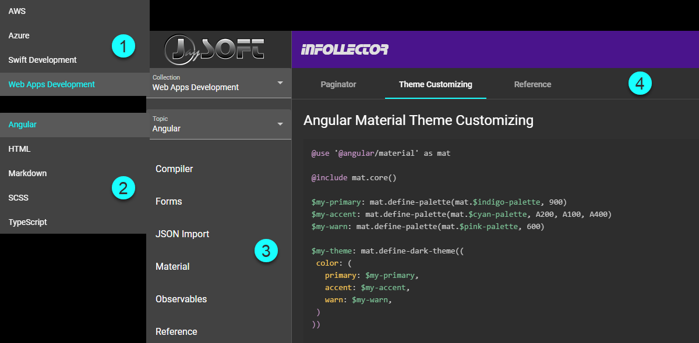

# JaySoft INFOLLECTOR

## Release 1.3.0 from 26-Jun-2022

Simple tool for displaying a four-level-structure of markdown files.

1. Collections  (sorted ascending)
2. Topics       (sorted ascending)
3. Titles       (sorted ascending)
4. Pages        (custom order from JSON)



```js
<root>
├ ...
├ collection-folder
│ ├ ...
│ ├ topic-folder
│ │ ├ ...
│ │ ├ title-folder
│ │ │ ├ ...
│ │ │ ├ markdown-file.md
│ │ │ ├ ...
│ │ │ └ _pages.json
│ │ ├ ...
│ │ └ _titles.json
│ ├ ...
│ └ _topics.json
├ ...
└ _collections.json
```

```js
_collections.json
[
  {
    "collection": "my-first-collection",
    "path": "my-first-collection-folder"
  },
  {
    "collection": "my-second-collection",
    "path": "my-second-collection-folder"
  },
  ...
]

_topics.json
[
  {
    "topic": "my-first-topic",
    "path": "my-first-topic-folder"
  },
  {
    "topic": "my-second-topic",
    "path": "my-second-topic-folder"
  },
  ...
]

_titles.json
[
  {
    "title": "my-first-title",
    "path": "my-first-title-folder"
  },
  {
    "title": "my-second-title",
    "path": "my-second-title-folder"
  },
  ...
]

_pages.json
[
  {
    "page": "my-first-page",
    "path": "my-first-page-file"    // no file extension
  },
  {
    "page": "my-second-page",
    "path": "my-second-page-file"   // no file extension
  },
  ...
]
```

&copy; JaySoft 2022
